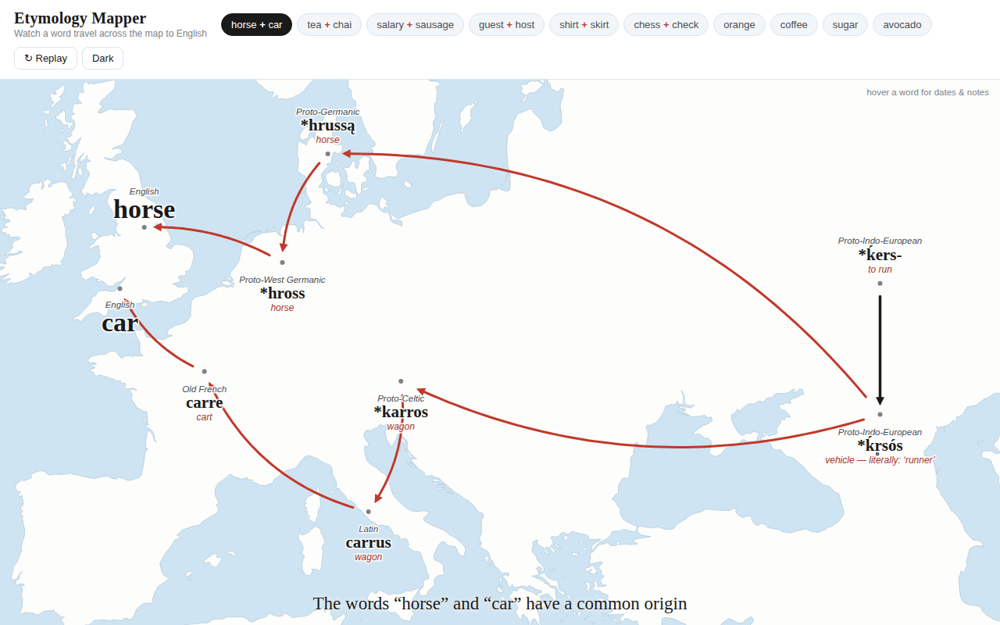

# Etymology Mapper

An interactive map that shows **where a word came from** — animating each stage of
its etymology as an arrow traveling across the map, ending at the modern English word.



Pick a word (or a pair of words that share a root) and watch its journey draw itself:

- **horse + car** — both from Proto-Indo-European *ḱers-* "to run"
- **tea + chai** — the same Chinese word, one by sea, one by land
- **salary + sausage** — both children of Latin *sāl* "salt"
- **guest + host** — split from one PIE word for "stranger"
- **shirt + skirt** — the same Germanic garment, landed twice
- **chess + check** — from the Persian word for "king"
- **wine + vine**, **guest + host**, and single-word journeys like **orange**,
  **coffee**, **ketchup**, **paradise**, **robot**, **juggernaut**…

**Or type any word.** The trace box parses the word's etymology section on
English Wiktionary live — its `{{inh}}`/`{{bor}}`/`{{der}}` derivation templates
form an ordered chain of (language, form, gloss) stages, which get placed using
a built-in table of ~180 language homelands. About 550 common words are also
precomputed into `data/traced.js`, so those work instantly (and offline).

Hover any word on the map for dates and historical notes. Click the sea to skip
the animation; **↻ Replay** runs it again. Light and dark themes included.

## Running it

Everything is self-contained (D3, topojson-client, and the world coastline data
are vendored in), so there's no build step and no network needed:

- just open `index.html` in a browser, or
- serve the folder: `python3 -m http.server` and visit `http://localhost:8000`

It also works as-is on GitHub Pages: enable Pages for this repo with the root of
the branch as the source.

## Adding a word

Add an entry to `js/data.js`. Each entry is a small graph:

```js
{
  id: "my-word",
  words: ["myword"],                     // shown on the picker chip
  caption: "Shown at the bottom of the map",
  nodes: [
    { id: "stage1", lang: "Latin", form: "verbum", gloss: "word",
      loc: [12.5, 41.9],                 // [longitude, latitude], approximate
      date: "c. 100 BCE",                // shown in the hover tooltip
      dy: -14,                           // label offset in px (negative = above the dot)
      dx: 0, anchor: "middle" },         // optional horizontal tuning
    { id: "myword", lang: "English", form: "myword", big: true, loc: [-1.5, 52.8] }
  ],
  edges: [
    { from: "stage1", to: "myword", bend: 0.2 }   // bend curves the arrow; sign flips the side
  ]
}
```

The map projection auto-fits to the stages, so entries can span anywhere from the
North Sea to the Pacific. Locations are deliberately approximate — they mark
roughly where a language community lived when it passed the word along.

To refresh or grow the offline cache of auto-traced words, edit the word list in
`scripts/precompute.js` and run `node scripts/precompute.js` (it's resumable and
merges into the existing `data/traced.js`).

## Notes on the etymologies

The journeys are curated and simplified for legibility (real etymologies have
more intermediate stages and scholarly hedging than fit on a map). Sources
consulted: standard references such as the Oxford English Dictionary's
etymologies, Etymonline, and Wiktionary's reconstructions.
